<!-- more -->

## Executive summary

In this project, I document what I learned while working with Forcepoint Data Loss Prevention (DLP) and demonstrate several practical data-loss detection scenarios.

The project focuses on detecting sensitive information through different data channels and detection techniques, including files, clipboard activity, regular expressions (Regex), and OCR-based detection. I also demonstrate how Regex can be used to identify sensitive information in both text and images.

Throughout the project, I configured and tested DLP policies, generated controlled test cases, analyzed the resulting detections, and investigated the corresponding DLP incidents.

## Lab Architecture 


- FSM (Forcepoint Security Manager): Central management server used to configure and manage the Forcepoint DLP environment and policies.

- SQL Server: Stores database and configuration data used by the Forcepoint environment.

- DLP OCR: Inspects images using OCR to extract text and detect sensitive information based on configured DLP rules.

- DC01: Active Directory Domain Controller responsible for user authentication, authorization, accounts, groups, and permissions.

- AD-PC: Domain-joined workstation with the Forcepoint DLP endpoint installed for monitoring and testing user activity.

- Current PC: Used to access the FSM management interface and perform the DLP testing scenarios.

## Goals 

In this Lab I will :
 
- Detect sensitive information in files and text.
- Detect sensitive information in images using OCR.
- Detect sensitive information in clipboard (copy/paste) activity.
- Detect sensitive information using Regex in both text and images.

### Things before go

I have added "Domain Admins" from AD as Administrators so that admins from AD can also login as Super Admin

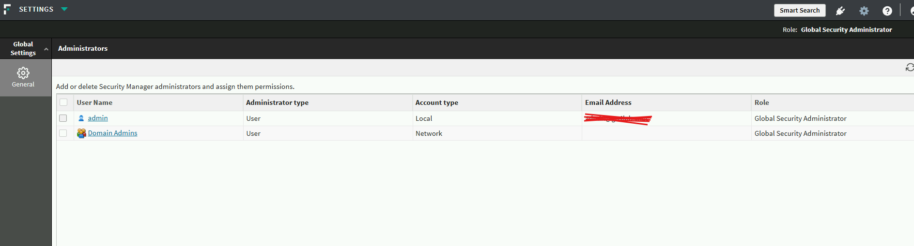

System Modules in the FSM 

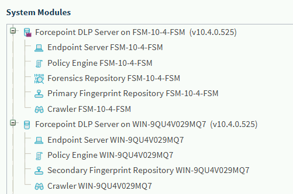

The First one is for FSM DLP core , and the second one is for the OCR detecting sensitive data in Images 

System Health for FSM machine :

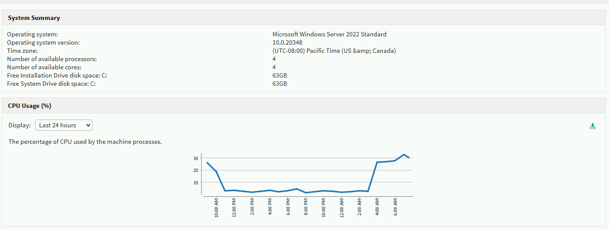

System Health for OCR machine :

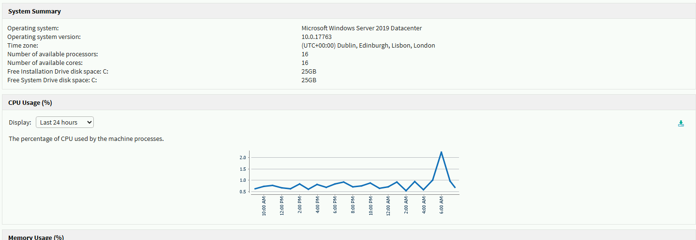

Endpoint status for local PC :

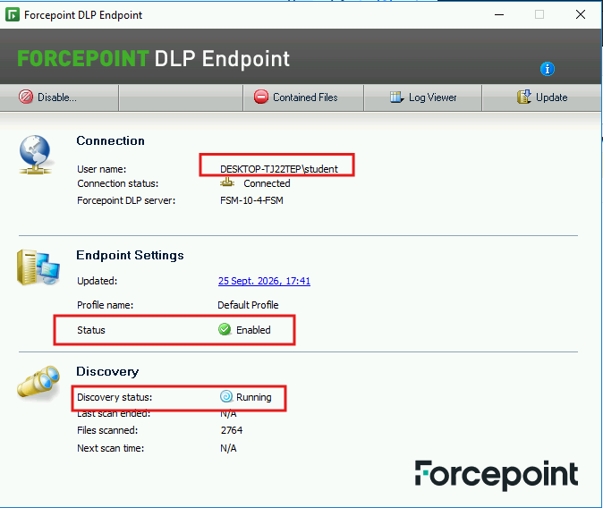

Endpoint status for AD PC :

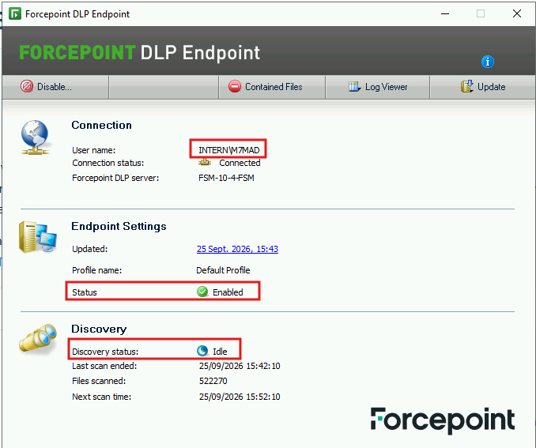

Test website : dlptest.com 

## Detection Scenarios 

### Scenario 1 — Detection in text

For this i have used the Word `VISA` for detecting it 

The Policy :

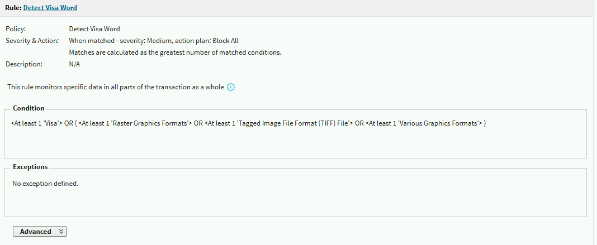

In the condition we can see that it detect the `visa` word or if its in image ( later ), and the action plan is `Block`

The trigger :

<video controls width="70%"> <source src="/posts/vid/dec1.mp4" type="video/mp4"> Your browser does not support the video tag. </video>


### Scenario 2 — Detection in image (OCR)

For this i have used the Word `VISA` for detecting it ( But in Image )

The Policy : 


Same as the first one , if we noticed in the condition there is a OR condition between word `VISA` and the image detection , so it will detect visa as word or as image 

The trigger :

<video controls width="70%"> <source src="/posts/vid/dec2.mp4" type="video/mp4"> Your browser does not support the video tag. </video>

### Scenario 3 — Regex detection in text and images

In this policy i have used the `Regex` of `Visa` :

```re
^4[0-9]{12}(?:[0-9]{3})?$
```

The policy :

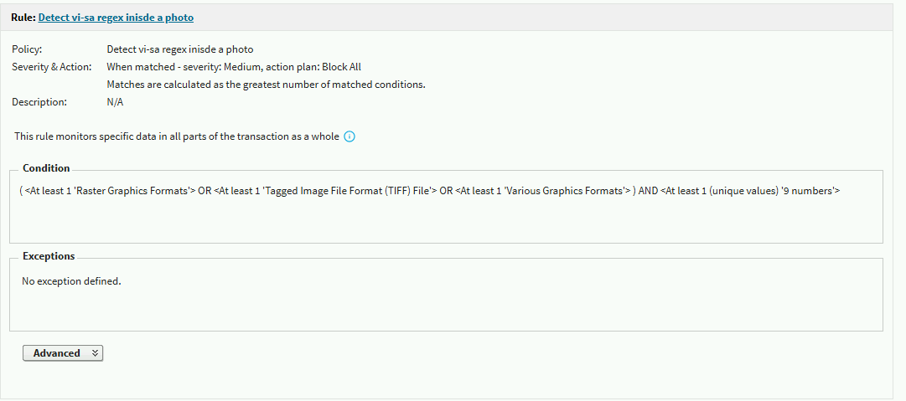

As we can see it detect `VISA Regex` and if its an Image 

The Trigger :

<video controls width="70%"> <source src="/posts/vid/dec3.mp4" type="video/mp4"> Your browser does not support the video tag. </video>


### Scenario 4 — Clipboard paste detection

The policy is same as the Policies before but in the `Destination` Tab we add Endpoint Application for the Copy/Paste :

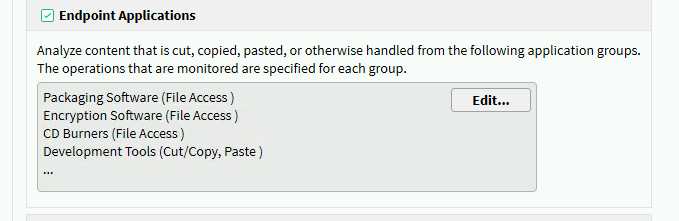

The Trigger :

<video controls width="70%"> <source src="/posts/vid/dec4.mp4" type="video/mp4"> Your browser does not support the video tag. </video>

As we can see it Block from pasting 

## Report & Incident 

We go to Reporting then incident we will find all the triggers there :

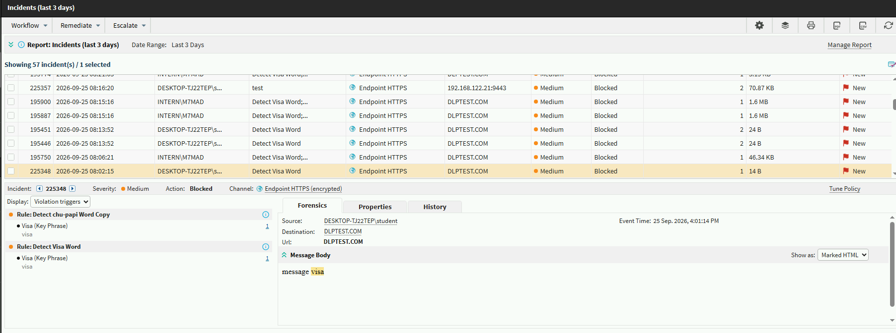

Here we can see multiple Blocks from our trigger that we have done it 

### Incident 1 — Regex detection in image (OCR)

Lets check this one :

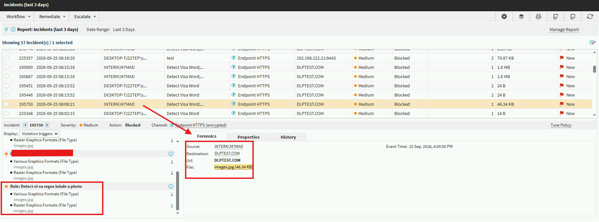

As we can see that this incident triggered by `Detect visa regex inside photo` rule  and the source of it `intern\m7mad` and the destination `dlptest.com` and the file is `image` , we got all the information need in an investigation 

### Incident 2 — Regex detection in text
Here another Incident about regex as text :

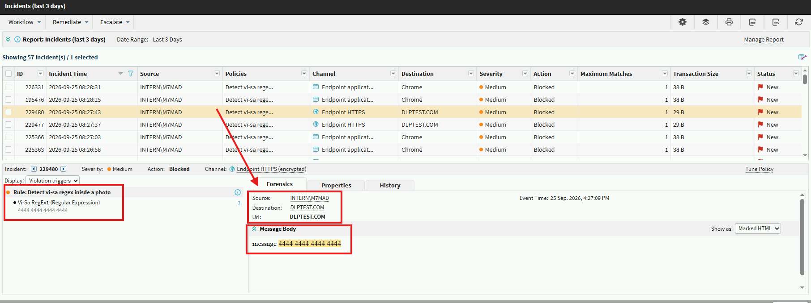

This one was triggered in the same machine `intern\m7mad` and the same destination ,but here it detect the `VISA regex` as text as we can see the message is `4444 4444 4444 4444` so it matched the rule `Visa Regex` (That rule check if its in an image or text both )

### Incident 3 — Clipboard paste detection

Here another Incident about Clipboard :

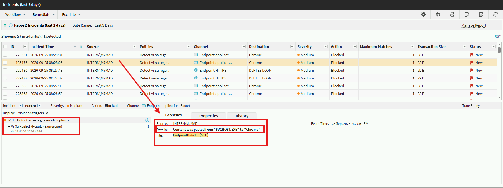

As we can see here the Source is `intern\m7mad` and the details `Content was pasted from "SVCHOST.EXE" to "Chrome"` and the copied data was `4444 4444 4444 4444` as done before 

### Incident 4 — Regex detection in image, non-domain host

Here another Incident about regex as photo :

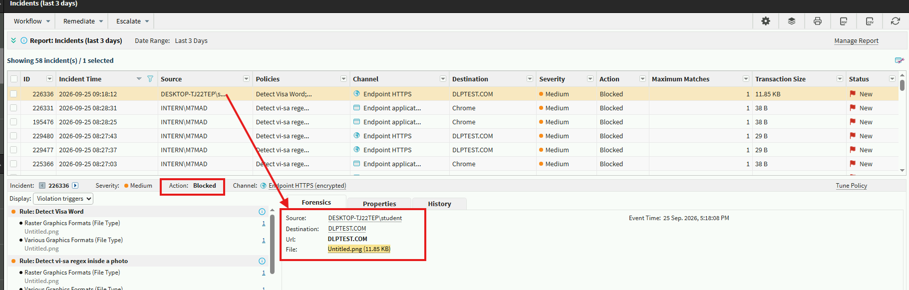

here Non-domain-Joined source `DESKTOP-TJ22TEP\student` and here an image was triggered `Untitled.png` with the same rule `Detect visa regex inside photo`

The incident provides the key information needed for an initial investigation, including the triggered rule, source user, destination, and file involved. This information can be used by SOC or DFIR analysts during triage to understand what happened, identify the relevant activity, and determine whether further investigation is required.


## **Conclusion**

Throughout this project, I demonstrated several Forcepoint DLP detection and enforcement scenarios, including text detection, OCR-based image detection, Regex-based detection, and clipboard monitoring.

The incident reports also demonstrated how DLP events can provide useful information for investigation and triage, such as the source user, endpoint, destination, triggered rule, detected content, and file involved.

From a SOC or DFIR perspective, these incident details can serve as an initial source of evidence during triage and can help determine whether additional investigation is required.
